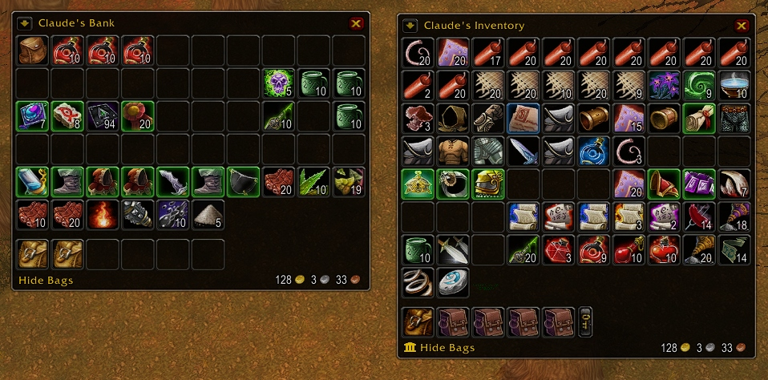

# Bagnon-Octo

A high-performance, unified **bag and bank** addon for Vanilla 1.12.1 / OctoWoW.

Bagnon merges all your inventory and bank bags into a single, clean window. It lets you view your bank from anywhere in the world, search for items by name, and check what items and gold your other characters have.

This version is stripped of old bloat, performance-optimized, bugfixed, and pre-configured with a sleek dark theme so it works smoothly out-of-the-box!

---

## ⚡ Quick Start & Commands

You can use `/bgn`, `/bagnon`, `/bagnon-octo`, or `/bo`:

* `/bgn` — Opens the main options menu.
* `/bgn bags` — Shows / hides your inventory.
* `/bgn bank` — Shows / hides your bank.
* `/bgn delete <character> [realm]` — Removes saved item data for a deleted or renamed character.
* `/bgn help` — Lists available commands.

### Handy Shortcuts:
* **Settings**: **Right-click** on the window title (e.g. *"Claude's Inventory"*) to change columns, transparency, background color, and scale.
* **Search**: **Double-click** on the window title to search for items. Press Escape to clear the search.
* **View Bank Anywhere**: Click the little **Bank Icon** at the bottom-left of your inventory.
* **Switch Characters**: Click the **Arrow Dropdown** next to the title to see what your alts have in their bags or bank.
* **Hide Specific Bags**: **Shift-Click** any bag button at the bottom to hide or show its slots.

---

## ✨ Features

* **One Clean Window**: No more messy multiple bag windows cluttering your screen.
* **View Bank from Anywhere**: Access a cached snapshot of your bank whenever you need it.
* **Item Quality Borders**: Colors item borders based on rarity (Poor, Common, Uncommon, Rare, Epic, Legendary).
* **Color-Coded Bag Slots**:
  * 🟡 **Yellow**: Ammo & Soul shard bags
  * 🟢 **Green**: Profession bags (Herbalism, Mining, Enchanting, Engineering, Gem bags)
  * 🟠 **Orange**: Keyring slots
* **Alt Item & Gold Tracker**: Hover over any item in the game to see how many of that item your other characters are holding (`[Character] has 2 (Bags), 5 (Bank)`).
* **Ready Out-of-the-Box**: Pre-configured to 10 columns with a dark 85% transparent background and expanded bag slots.

---

## 📥 Installation

1. Download or clone this repository.
2. Place the `Bagnon-Octo` folder into your `World of Warcraft/Interface/AddOns/` directory.
3. Your path should look like: `World of Warcraft/Interface/AddOns/Bagnon-Octo/`
4. Launch the game or type `/console reloadui` in chat.

---

## 🗄️ SavedVariables & Addon Maintenance

Bagnon-Octo saves two types of configuration files in your `WTF` folder:

1. **`BagnonSets` (Per-Character UI Settings)**:
   * Saves individual window position, column count, opacity, scale, background color, and bag bar visibility.
   * **Location**: `WTF/Account/<ACCOUNT_NAME>/<Realm>/<Character>/SavedVariables/Bagnon-Octo.lua`

2. **`BagnonForeverData` (Account-Wide Character Item Cache)**:
   * Saves offline snapshots of items, bags, bank slots, and gold across all characters on your realm for tooltip tracking and offline browsing.
   * **Location**: `WTF/Account/<ACCOUNT_NAME>/SavedVariables/Bagnon-Octo.lua`

### How to Clean or Reset Data:
* **Remove a Single Alt from Cache**: Type `/bgn delete <CharacterName>` in-game (e.g. `/bgn delete Claude`).
* **Reset UI Layout & Positions**: Delete the character file at `WTF/Account/<ACCOUNT_NAME>/<Realm>/<Character>/SavedVariables/Bagnon-Octo.lua` while WoW is closed.
* **Full Clean Reset**: Delete all `Bagnon-Octo.lua` files from your `WTF` folder while the game is closed.

---

## 💻 Technical Architecture & Performance Notes

This edition was overhauled for Vanilla 1.12.1 and OctoWoW with modern client optimizations:

* **Consolidated Single-Package Architecture**: Merged legacy multi-folder dependencies (`Bagnon_Core`, `Bagnon_Forever`, `Bagnon_Spot`, `Bagnon_Options`) into a single self-contained addon package.
* **Zero-GC Border Color Engine**: Replaced regex string parsing (`strfind` on hex colors) with direct client API quality lookups and pre-cached widget pointers (`button.border`, `button.cooldown`, `button.normalTexture`), eliminating runtime garbage collection churn.
* **Fast $O(1)$ Offline Item Lookups**: Modernized `BagnonDB.GetItemTotal` with direct raw string parsing, skipping redundant texture loading and `GetItemInfo` queries during tooltip hovers.
* **Memoized Substring Search**: Added LRU memoization for search query normalization, eliminating string lowercasing churn across item slots.
* **Crash-Free Substring Search**: Replaced Lua pattern matching in `spot.lua` with plain substring searches (`string.find(..., 1, true)`), eliminating Lua crashes when searching for items containing brackets or symbols (`[`, `]`, `+`, `-`).
* **Real-time Cooldown Spirals**: Fixed `BAG_UPDATE_COOLDOWN` event handling (which passes no bag argument in 1.12.1) so potion, trinket, and hearthstone cooldown spirals animate live while bags remain open.
* **Hyperlink Nil-Safety**: Added nil checks when formatting hyperlinks in `database.lua` to prevent concatenation crashes on uncached items.
* **Clean FrameXML Startup**: Fixed dynamic XML anchor templates and removed `Bindings.xml` from the TOC manifest to eliminate engine startup warnings in `FrameXML.log`.
* **Database Retention**: Removed client-build comparison wipes in `BagnonForever` so saved character caches survive client patches.
* **Pure English Engine**: Stripped legacy dead non-English locales and Ace libraries for a minimal memory footprint.

---

## 👥 Credits & Attribution

* **Tuller** — Original creator and developer of Bagnon, Banknon, Bagnon_Forever, and Bagnon_Spot.
* **McPewPew** — Created the single-folder build for Turtle WoW / Vanilla launcher and added the quick bank viewer button.
* **Fostercare5988** — Modernization, OctoWOW / SuperWoW compatibility updates, performance optimizations, bugfixes, UI defaults, and repository maintenance.

---

## 📜 Changelog

### v1.0.0-Octo
* Initial release of the streamlined OctoWOW edition.
* Pre-configured default UI settings: 10 columns, 85% opacity, black background, and expanded bag bar.
* High-performance zero-GC item border color rendering and widget caching.
* Fast $O(1)$ offline database alt-item scanning for tooltips.
* Memoized crash-free search engine supporting symbols and brackets.
* Fixed cooldown animation updates for open bag and bank windows.
* Fixed profession bag detection on offline characters.
* Cleaned FrameXML startup logs (removed Bindings from TOC, fixed static anchors).
* Consolidated single-package folder layout with clean pure English engine.
